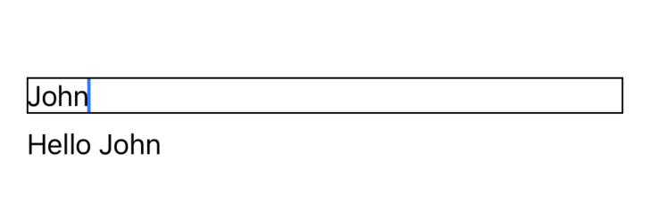
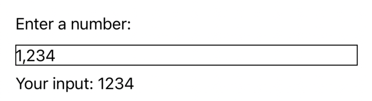
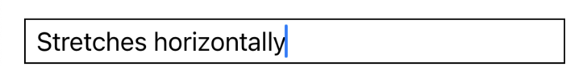
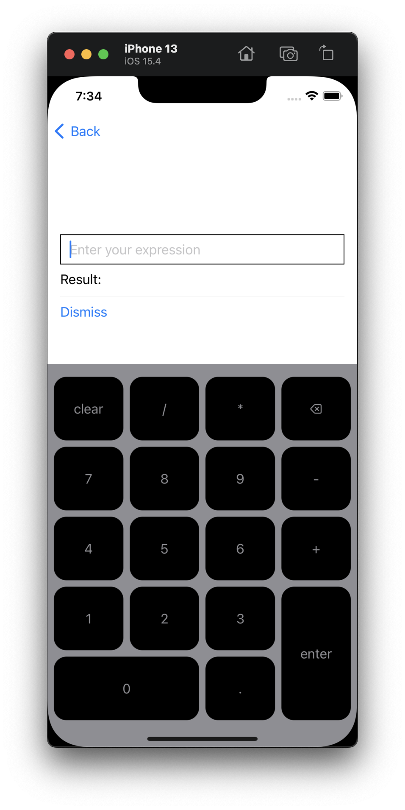
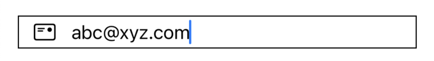
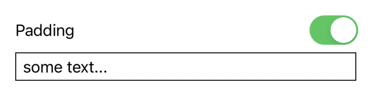
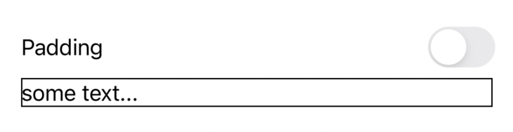

<p>
  <a href="https://github.com/vinceplusplus/uikit-textfield/actions?query=workflow%3Atest+event%3Apush">
    
  </a>
  <a href="https://codecov.io/gh/vinceplusplus/uikit-textfield">
    
  </a>
</p>

# uikit-textfield

`uikit-textfield` offers `UIKitTextField` which makes using `UITextField` in SwiftUI a breeze.
 
From data binding, focus binding, handling callbacks from `UITextFieldDelegate`,
custom `UITextField` subclass, horizontal/vertical stretching, `inputView`/`inputAccessoryView`, 
to extra configuration, `UIKitTextField` is the complete solution.

- [Installation](#installation)
- [Usage](#usage)
  - [Data Binding](#data-binding)
    - [Text](#text)
    - [Formatted Value](#formatted-value)
    - [Custom Data Binding](#custom-data-binding)
  - [Placeholder](#placeholder)
  - [Font](#font)
  - [Text Color](#text-color)
  - [Clear on Begin Editing](#clear-on-begin-editing)
  - [Clear on Insertion](#clear-on-insertion)
  - [Clear Button Mode](#clear-button-mode)
  - [Focus Binding](#focus-binding)
    - [Bool](#bool)
    - [Hashable](#hashable)
  - [Stretching](#stretching)
  - [Input View / Input Accessory View](#input-view--input-accessory-view)
  - [Custom Text Field Class](#custom-text-field-class)
  - [Extra Configuration](#extra-configuration)
  - [UITextFieldDelegate](#uitextfielddelegate)
  - [UITextInputTraits](#uitextinputtraits)
- [Examples](#examples)
- [Additional Notes](#additional-notes)


## Installation

To install through Xcode, follow the [official guide](https://developer.apple.com/documentation/xcode/adding_package_dependencies_to_your_app) to add the following your Xcode project
```
https://github.com/vinceplusplus/uikit-textfield.git
```

To install through Swift Package Manager, add the following as package dependency and target dependency respectively
```
.package(url: "https://github.com/vinceplusplus/uikit-textfield.git", from: "2.0")
```
```
.product(name: "UIKitTextField", package: "uikit-textfield")
```

## Usage

All configurations are done using `UIKitTextField.Configuration` and are in turn passed to
`UIKitTextField`'s `.init(config: )`

### Data binding

#### Text

```swift
func value(text: Binding<String>) -> Self
```

```swift
@State var name: String = ""

var body: some View {
  VStack(alignment: .leading) {
    UIKitTextField(
      config: .init()
        .value(text: $name)
    )
    .border(Color.black)
    Text("\(name.isEmpty ? "Please enter your name above" : "Hello \(name)")")
  }
  .padding()
}
```



#### Formatted value

```swift
@available(iOS 15.0, *)
func value<F>(value: Binding<F.FormatInput>, format: F) -> Self
where
  F: ParseableFormatStyle,
  F.FormatOutput == String

@available(iOS 15.0, *)
func value<F>(value: Binding<F.FormatInput?>, format: F) -> Self
where
  F: ParseableFormatStyle,
  F.FormatOutput == String
  
func value<V>(value: Binding<V>, formatter: Formatter) -> Self

func value<V>(value: Binding<V?>, formatter: Formatter) -> Self
```

When the text field is not the first responder, it will take value from the binding and display in the specified formatted way

When the text field is the first responder, every change will try to update the binding. If it's a binding of a non optional value,
an invalid input will preserve the last value. If it's a binding of an optional value, an invalid input will set the value to `nil`.

```swift
@State var value: Int = 0

// ...

Text("Enter a number:")

UIKitTextField(
  config: .init()
    .value(value: $value, format: .number)
    //.value(value: $value, formatter: NumberFormatter())
)
.border(Color.black)

// NOTE: avoiding the formatting behavior which comes from Text()
Text("Your input: \("\(value)")")
```



#### Custom Data Binding

```swift
func value(
  updateViewValue: @escaping (_ textField: UITextFieldType) -> Void,
  onViewValueChanged: @escaping (_ textField: UITextFieldType) -> Void
) -> Self
```

### Placeholder

```swift
func placeholder(_ placeholder: String?) -> Self
```

```swift
UIKitTextField(
  config: .init()
    .placeholder("some placeholder...")
)
```

### Font

```swift
func font(_ font: UIFont?) -> Self
```

Note that since there are no ways to convert back from a `Font` to `UIFont`, the configuration
can only take a `UIFont`

```swift
UIKitTextField(
  config: .init()
    .font(.systemFont(ofSize: 16))
)
```

### Text Color

```swift
func textColor(_ color: Color?) -> Self
```

```swift
UIKitTextField(
  config: .init()
    .textColor(.red)
)
```

### Text Alignment

```swift
func textAlignment(_ textAlignment: NSTextAlignment?) -> Self
```

```swift
UIKitTextField(
  config: .init()
    .textAlignment(.center)
)
```

### Clear on Begin Editing

```swift
func clearsOnBeginEditing(_ clearsOnBeginEditing: Bool?) -> Self
```

```swift
UIKitTextField(
  config: .init()
    .clearsOnBeginEditing(true)
)
```

### Clear on Insertion

```swift
func clearsOnInsertion(_ clearsOnInsertion: Bool?) -> Self
```

```swift
UIKitTextField(
  config: .init()
    .clearsOnInsertion(true)
)
```

### Clear Button Mode

```swift
func clearButtonMode(_ clearButtonMode: UITextField.ViewMode?) -> Self
```

```swift
UIKitTextField(
  config: .init()
    .clearButtonMode(.always)
)
```

### Focus Binding

Similar to `@FocusState`, we could use an orindary `@State` to do a 2 way focus binding

#### Bool

```swift
func focused(_ binding: Binding<Bool>) -> Self
```

```swift
@State var name = ""
@State var isFocused = false

VStack {
  Text("Your name:")
  UIKitTextField(
    config: .init()
      .value(text: $name)
      .focused($isFocused)
  )
  Button {
    if name.isEmpty {
      isFocused = true
    } else {
      isFocused = false
    }
  } label: {
    Text("Submit")
  }
}
```

#### Hashable

```swift
func focused<Value>(_ binding: Binding<Value?>, equals value: Value?) -> Self where Value: Hashable
```

```swift
enum Field {
  case firstName
  case lastName
}

@State var firstName = ""
@State var lastName = ""
@State var focusedField: Field?

VStack {
  Text("First Name:")
  UIKitTextField(
    config: .init()
      .value(text: $firstName)
      .focused(focusedField, equals: .firstName)
  )
  Text("Last Name:")
  UIKitTextField(
    config: .init()
      .value(text: $lastName)
      .focused(focusedField, equals: .lastName)
  )
  Button {
    if firstName.isEmpty {
      focusedField = .firstName
    } else if lastName.isEmpty {
      focusedField = .lastName
    } else {
      focusedField = nil
    }
  } label: {
    Text("Submit")
  }
}
```

### Stretching

By default, `UIKitTextField` will stretch horizontally but not vertically 

```swift
func stretches(horizontal: Bool, vertical: Bool) -> Self
```

```swift
UIKitTextField(
  config: .init {
    PaddedTextField()
  }
    .stretches(horizontal: true, vertical: false)
)
.border(Color.black)
```

Note that `PaddedTextField` is just a simple internally padded `UITextField`, see more in custom init



```swift
UIKitTextField(
  config: .init {
    PaddedTextField()
  }
    .stretches(horizontal: false, vertical: false)
)
.border(Color.black)
```


### Input View / Input Accessory View

Supporting `UITextField.inputView` and `UITextField.inputAccessoryView` by accepting a user defined `SwiftUI` view for each of them

```swift
func inputView(content: InputViewContent<UITextFieldType>) -> Self

func inputAccessoryView(content: InputViewContent<UITextFieldType>) -> Self
```

```swift
VStack(alignment: .leading) {
  UIKitTextField(
    config: .init {
      PaddedTextField()
    }
      .placeholder("Enter your expression")
      .value(text: $expression)
      .focused($isFocused)
      .inputView(content: .view { uiTextField in
        KeyPad(uiTextField: uiTextField, onEvaluate: onEvaluate)
      })
      .shouldReturn { _ in
        onEvaluate()
        return false
      }
  )
  .padding(4)
  .border(Color.black)
  
  Text("Result: \(result)")
  
  Divider()

  Button {
    isFocused = false
  } label: {
    Text("Dismiss")
  }
}
.padding()
```

Implementation of `KeyPad` can be found in `InputViewPage` from the example code. But the idea is to accept a `UITextField`
parameter and render some buttons that do `uiTextField.insertText("...")` or `uiTextField.deleteBackward()`, like the
following:

```swift
struct CustomKeyboard: View {
  let uiTextField: UITextField
  var body: some View {
    VStack {
      HStack {
        Button {
          uiTextField.insertText("1")
        } label: {
          Text("1")
        }
        Button {
          uiTextField.insertText("2")
        } label: {
          Text("2")
        }
        Button {
          uiTextField.insertText("3")
        } label: {
          Text("3")
        }
      }
      HStack { /* ... */ }
      // ...
    }
  }
}
```



### Custom Text Field Class

```swift
init(_ makeUITextField: @escaping () -> UITextFieldType)
```

A common use case of a `UITextField` subclass is to provide some internal padding which is also tappable. The following
example demonstrates some extra leading padding to accomodate even an icon image

```swift
class CustomTextField: BaseUITextField {
  let padding = UIEdgeInsets(top: 4, left: 8 + 32 + 8, bottom: 4, right: 8)
  public override func textRect(forBounds bounds: CGRect) -> CGRect {
    super.textRect(forBounds: bounds).inset(by: padding)
  }
  public override func editingRect(forBounds bounds: CGRect) -> CGRect {
    super.editingRect(forBounds: bounds).inset(by: padding)
  }
}

UIKitTextField(
  config: .init {
    CustomTextField()
  }
    .focused($isFocused)
    .textContentType(.emailAddress)
    .keyboardType(.emailAddress)
    .autocapitalizationType(UITextAutocapitalizationType.none)
    .autocorrectionType(.no)
)
.background(alignment: .leading) {
  HStack(spacing: 0) {
    Color.clear.frame(width: 8)
    ZStack {
      Image(systemName: "mail")
    }
    .frame(width: 32)
  }
}
.border(Color.black)
```



`UITextFieldType` needs to conform to `UITextFieldProtocol` which is shown below:

```swift
public protocol UITextFieldProtocol: UITextField {
  var inputViewController: UIInputViewController? { get set }
  var inputAccessoryViewController: UIInputViewController? { get set }
}
```

Basically, it needs have `inputViewController` and `inputAccessoryViewController` writable so the support 
for custom input view and custom input accessory view will work

For most use cases, `BaseUITextField`, which provides baseline implementation of `UITextFieldProtocol`, 
can be subclassed to add more user defined behavior

### Extra Configuration

```swift
func configure(handler: @escaping (_ uiTextField: UITextFieldType) -> Void) -> Self
```

If there are configurations that `UIKitTextField` doesn't support out of the box, this is the place where we could add them.
The extra configuration will be executed at the end of `updateUIView()` after applying all supported configuration (like data binding, etc)

```swift
class PaddedTextField: BaseUITextField {
  var padding = UIEdgeInsets(top: 4, left: 8, bottom: 4, right: 8) {
    didSet {
      setNeedsLayout()
    }
  }
  
  public override func textRect(forBounds bounds: CGRect) -> CGRect {
    super.textRect(forBounds: bounds).inset(by: padding)
  }
  
  public override func editingRect(forBounds bounds: CGRect) -> CGRect {
    super.editingRect(forBounds: bounds).inset(by: padding)
  }
}

@State var text = "some text..."
@State var pads = true

var body: some View {
  VStack {
    Toggle("Padding", isOn: $pads)
    UIKitTextField(
      config: .init {
        PaddedTextField()
      }
        .value(text: $text)
        .configure { uiTextField in
          uiTextField.padding = pads ? .init(top: 4, left: 8, bottom: 4, right: 8) : .zero
        }
    )
    .border(Color.black)
  }
  .padding()
}
```

The above example provides a button to toggle internal padding




### UITextFieldDelegate

`UITextFieldDelegate` is fully supported

```swift
func shouldBeginEditing(handler: @escaping (_ uiTextField: UITextFieldType) -> Bool) -> Self

func onBeganEditing(handler: @escaping (_ uiTextField: UITextFieldType) -> Void) -> Self

func shouldEndEditing(handler: @escaping (_ uiTextField: UITextFieldType) -> Bool) -> Self

func onEndedEditing(handler: @escaping (_ uiTextField: UITextFieldType, _ reason: UITextField.DidEndEditingReason) -> Void) -> Self

func shouldChangeCharacters(handler: @escaping (_ uiTextField: UITextFieldType, _ range: NSRange, _ replacementString: String) -> Bool) -> Self

func onChangedSelection(handler: @escaping (_ uiTextField: UITextFieldType) -> Void) -> Self

func shouldClear(handler: @escaping (_ uiTextField: UITextFieldType) -> Bool) -> Self

func shouldReturn(handler: @escaping (_ uiTextField: UITextFieldType) -> Bool) -> Self
```

### UITextInputTraits

Most of the commonly used parts of `UITextInputTraits` are supported

```swift
func keyboardType(_ keyboardType: UIKeyboardType?) -> Self

func keyboardAppearance(_ keyboardAppearance: UIKeyboardAppearance?) -> Self

func returnKeyType(_ returnKeyType: UIReturnKeyType?) -> Self

func textContentType(_ textContentType: UITextContentType?) -> Self

func isSecureTextEntry(_ isSecureTextEntry: Bool?) -> Self

func enablesReturnKeyAutomatically(_ enablesReturnKeyAutomatically: Bool?) -> Self

func autocapitalizationType(_ autocapitalizationType: UITextAutocapitalizationType?) -> Self

func autocorrectionType(_ autocorrectionType: UITextAutocorrectionType?) -> Self

func spellCheckingType(_ spellCheckingType: UITextSpellCheckingType?) -> Self

func smartQuotesType(_ smartQuotesType: UITextSmartQuotesType?) -> Self

func smartDashesType(_ smartDashesType: UITextSmartDashesType?) -> Self

func smartInsertDeleteType(_ smartInsertDeleteType: UITextSmartInsertDeleteType?) -> Self
``` 

## Examples

`Examples/Example` is an example app that demonstrate how to use `UIKitTextField`

## Additional Notes

`UITextField.isEnabled` is actually supported by the vanilla `.disabled(/* ... */)` which might not be very obvious
